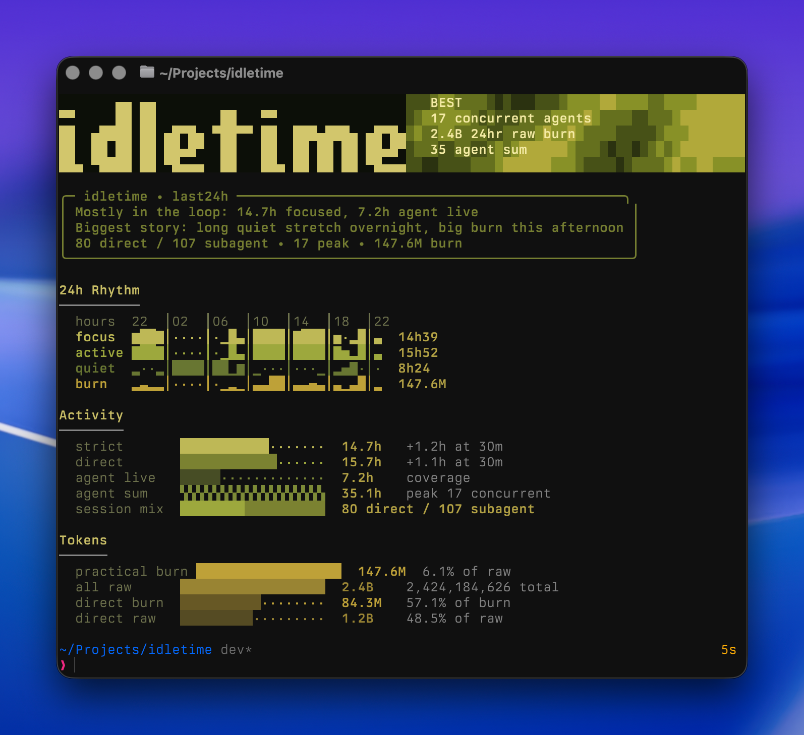

# idletime

Local Bun CLI for Codex activity, token burn, visual 24-hour rhythm charts, and wake-window idle time.

`idletime` reads local Codex session logs from `~/.codex/sessions` and turns them into a trailing-window dashboard that answers:

- When was I actually focused?
- When was the direct thread active?
- Where were the dead spots or awake idle gaps?
- Which hours spiked in token burn?
- How much of the day was direct work versus subagent runtime?



## How It Works

`idletime` is read-only. It scans your local Codex session logs under `~/.codex/sessions/YYYY/MM/DD/*.jsonl` and builds reports from those raw events.

At a high level:

- it classifies sessions as direct or subagent from `session_meta.payload.source`
- it treats real `user_message` arrivals as the strongest focus signal
- it builds activity blocks by extending events forward by the idle cutoff
- it computes hourly and summary burn from token-count deltas, not just final session totals
- it clips everything to the requested window so `last24h` means the actual last 24 hours

That is why the dashboard can show both a fast visual story and defensible totals.

## Install

Local development:

```bash
bun install
```

After publish, expected install paths are:

```bash
npm install -g idletime
```

```bash
bun add -g idletime
```

Or run it without a global install:

```bash
npx idletime --help
```

```bash
bunx idletime --help
```

## Start Here

The default command is the main product:

```bash
bun run idletime
```

That shows:

- A framed trailing-24h dashboard
- A `24h Rhythm` strip for `focus`, `active`, `quiet` or `idle`, and `burn`
- `Spike Callouts` for the biggest burn hours
- A lower detail section with activity, tokens, and wake-window stats

## Core Concepts

- `focus`: strict engagement inferred from real `user_message` arrivals
- `active`: broader direct-session movement in the main thread
- `idle`: awake idle time, only shown when you pass `--wake`
- `quiet`: non-active time when no wake window is provided
- `burn`: practical burn, calculated as `input - cached_input + output`

Additional behavior:

- `last24h`: the default trailing window, clipped to the actual last 24 hours
- `today`: local midnight to now
- `direct`: user-started work in the main CLI or compatible direct session types
- `subagent`: spawned agent sessions
- `idle cutoff`: how long activity stays alive after the last event before it counts as quiet or idle

## Commands

Default trailing-24h dashboard:

```bash
bun run idletime
```

Turn quiet time into real awake idle:

```bash
bun run idletime --wake 07:45-23:30
```

Trim the output into a screenshot card:

```bash
bun run idletime --wake 07:45-23:30 --share
```

Show the current local day only:

```bash
bun run idletime today
```

Limit to one workspace:

```bash
bun run idletime today --workspace-only /path/to/demo-workspace
```

Open the full hourly table:

```bash
bun run idletime hourly --window 24h --workspace-only /path/to/demo-workspace
```

Group the summary by model and effort:

```bash
bun run idletime last24h --group-by model --group-by effort
```

## Share Mode

`--share` keeps the visual story and trims the secondary detail:

- header
- 24-hour rhythm strip
- top-3 burn spike callouts
- compact snapshot block

That is the best mode for terminal screenshots.

## What The Visuals Mean

The top of the dashboard is intentionally visual-first.

- `24h Rhythm` gives one character per hour bucket across the trailing day
- `focus` makes it obvious where you were actually engaged
- `active` shows the broader direct-session footprint
- `idle` appears when you pass `--wake`, otherwise that lane becomes `quiet`
- `burn` highlights token spikes without making you read the table first
- `Spike Callouts` surfaces the top burn hours immediately

## Help

```bash
bun run idletime --help
```

The help screen explains the modes, the chart lanes, and includes copy-paste examples.

Version output:

```bash
bun run idletime --version
```

Once published, that also works as:

```bash
idletime --version
```

## Validation

```bash
bun run typecheck
bun test
```

Release QA:

```bash
bun run qa
```

That QA pass reads:

- `qa/data/user-journeys.csv` for installed-binary shell journeys
- `qa/data/coverage-matrix.csv` for required release coverage rows

It builds the package, packs the current checkout, installs the tarball into an isolated temp `BUN_INSTALL`, seeds synthetic Codex session logs, and runs the shell journeys against the installed `idletime` binary.

## Release Prep

Build the publishable CLI bundle:

```bash
bun run build
```

Dry-run the release checks:

```bash
bun run check:release
```

`check:release` now runs:

- `bun run typecheck`
- `bun test`
- `bun run qa`
- `npm pack --dry-run`

Dry-run the Bun publish flow:

```bash
bun run publish:dry-run
```

Preview exactly what npm would ship:

```bash
bun run pack:dry-run
```

## GitHub Release Flow

This repo now includes:

- `.github/workflows/ci.yml` for push and pull-request release checks
- `.github/workflows/publish.yml` for the actual npm publish flow

What it does:

- `ci.yml` runs on pushes to `dev` and `main`, plus pull requests
- `publish.yml` runs on manual dispatch or GitHub release publish
- installs Bun and Node on a GitHub-hosted runner
- runs `bun run check:release`
- publishes to npm with `npm publish --access public --provenance`

What you need in GitHub:

- the `NPM_TOKEN` secret already added to the repo
- the repo pushed to GitHub so Actions can run
- the repo URL in `package.json` now points at `https://github.com/ParkerRex/idletime`

## Release Notes

- The published binary is `idletime`.
- The package is prepared for public publish on npm and Bun.
- The package name `idletime` currently returns an npm `E404` with an unpublished notice, so it appears reclaimable as of March 27, 2026, but you should still verify availability again immediately before the first publish.
- `package.json` currently uses `license: "UNLICENSED"` as a deliberate placeholder. Choose the real license you want before the first public release.

## npm Site Checklist

If you want the cleanest setup, use npm trusted publishing with GitHub Actions instead of a long-lived token.

Preferred path:

1. Publish the package from GitHub Actions, not manually from your laptop.
2. On npm, open the package settings and configure a `Trusted Publisher` for your GitHub Actions workflow.
3. Keep `id-token: write` in the publish workflow so npm can use OIDC.

Official docs:

- npm trusted publishers: https://docs.npmjs.com/trusted-publishers/
- GitHub npm publishing workflow: https://docs.github.com/en/actions/tutorials/publish-packages/publish-nodejs-packages

If you want to use a token instead:

1. On npm, go to `Access Tokens`.
2. Generate a new granular token on the website.
3. Give it `Read and write` package access.
4. Make sure it can publish when 2FA is enabled. npm rejected the first workflow run because the token did not satisfy that requirement.
4. Store it in GitHub as `NPM_TOKEN`.

Official token docs:

- https://docs.npmjs.com/creating-and-viewing-access-tokens/

Important:

- trusted publishing currently requires GitHub-hosted runners
- trusted publishing is preferred over long-lived tokens
- provenance is enabled in `package.json`, but for provenance to be fully useful you should also add the real public GitHub `repository` metadata before first publish
- since you already added `NPM_TOKEN`, the included GitHub Actions workflow can publish with the token path right now
- if the workflow fails with `403 Forbidden` and mentions two-factor authentication, replace `NPM_TOKEN` with an automation token or a granular token that can bypass 2FA for publish

## Before First Publish

- choose the real license and replace `UNLICENSED` in `package.json`
- add the actual GitHub repo metadata to `package.json`
- run `bun run check:release`
- recheck `npm view idletime version`
- either publish from GitHub Releases or run the workflow manually
